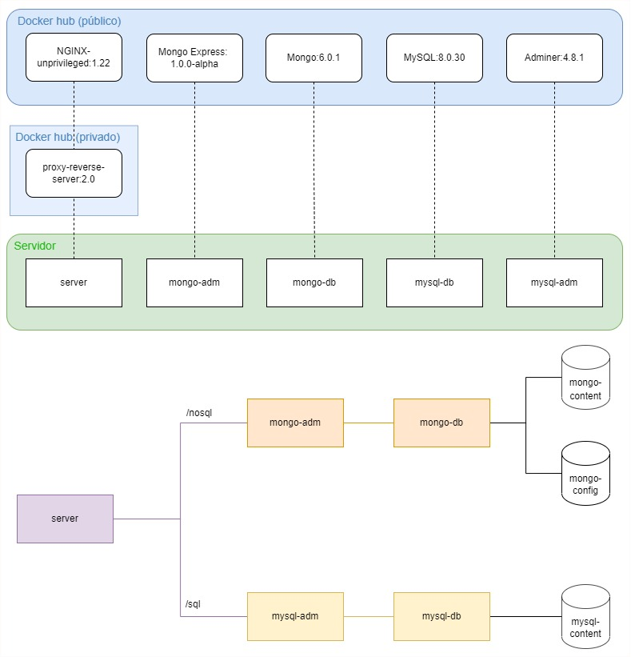

# Projeto 01 - Implementando sistema com Docker compose

## Sobre o sistema criado
O sistema conta ao todo com 05 containers:
1. **NGINX:** Servidor para proxy reverse do sistema
2. **MongoExpress:** Administrador do banco NoSQL MongoDB
3. **Mongo:** Banco de dados NOSQL
4. **MySQL:** Banco de dados SQL
5. **Adminer:** Administrador do banco SQL MySQL

## Possíveis caminhos
- */sql* acessa o administrador do banco SQL
- */nosql* acessa o administrador do banco NOSQL
- */* acessa a página de informações

## Funcionamento do projeto
